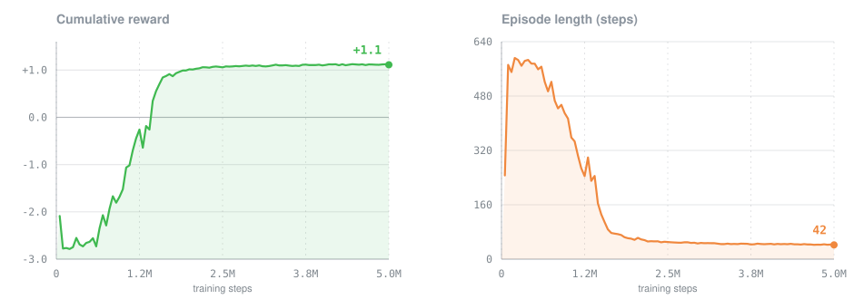
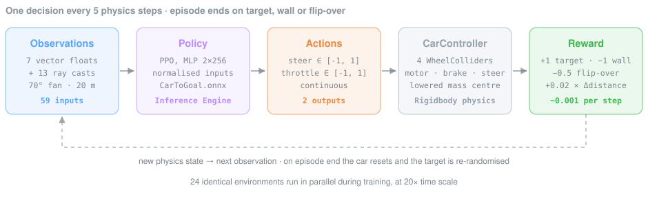

<h1 align="center">Drive&#8209;to&#8209;Target</h1>

<p align="center">
  <b>A car in Unity that learned to drive to a goal by itself.</b><br>
  Nobody programmed the driving. The car practised for 5 million tries and worked it out.
</p>

<p align="center">
  
  
  
  
  
</p>

---

## Demo

https://github.com/user-attachments/assets/ebc8025c-5141-4995-8eaf-c337b378eb02

> **Demo video goes here.** The car drives to a target. Every time it arrives, the target jumps to a new random spot and the car goes again.

---

## What this project is

This is a small Unity project where a car learns to drive to a goal on its own.

The usual way to move a car to a point in a game is to write the rules by hand: turn the wheel towards the
target, brake before the corner, stop when you arrive. **This project has none of those rules.** Instead the car
learns by trial and error, the same way you would train a dog:

- it tries something,
- it gets a **reward** when the result is good (it reached the goal) or a **penalty** when the result is bad (it hit a wall),
- it slowly changes its behaviour to collect more rewards.

This approach is called **reinforcement learning**. Here it runs on
[Unity ML-Agents](https://github.com/Unity-Technologies/ml-agents), the official Unity toolkit for it.

The car is a real physics object: it has weight, it slides, it can spin out and flip over. So the car does not
just *move* to the goal. It has to *drive* there, using only a steering wheel and a pedal, exactly like a player would.

---

## The result

At the start, the car knows nothing. It does not know what a wall is, what the goal is, or that turning the
wheel changes direction. It just presses the pedal and crashes.

After 5 million practice steps, it reaches the goal in almost every attempt, and it takes a short route to get there.

|                              | Before training                              | After training                        |
| ---------------------------- | -------------------------------------------- | ------------------------------------- |
| Average score per attempt    | −2.09 (mostly crashes)                        | **+1.11** (a clean run scores about +1.3) |
| Average time per attempt     | about 25 seconds of driving                   | **about 4 seconds of driving**        |
| How an attempt usually ended | crashed into a wall, or ran out of time       | **reached the goal**                  |

All of this training took **about 51 minutes** on one desktop computer. That is possible because the game runs
20 times faster than real time during training, and because 24 copies of the same little arena practise at the
same time and share what they learn.



**How to read the charts.** Left is the score, right is how long one attempt lasts.

1. **First ~600,000 steps.** The car floors the pedal and drives straight into walls. The score sits near −2.5 and attempts run until the time limit.
2. **Around 1,450,000 steps.** The score crosses zero. The car now reaches the goal often enough to make up for the crashes.
3. **Around 2,000,000 steps.** The score passes +1.0. Reaching the goal has become the normal outcome, not a lucky one.
4. **The rest of the training.** The score barely moves, but the attempts get much shorter: from 62 decisions down to 42, which is about 6 seconds of driving down to about 4. The car keeps winning and now looks for the fastest way to do it.

---

## How the car learns

Every so often the car takes a snapshot of its situation, decides what to do, and gets points for the outcome.
That loop repeats millions of times.



### 1. What the car sees

The car has no camera. It gets 59 numbers, ten times per second of game time.

| What it gets              | Numbers | In plain words                                                                        |
| ------------------------- | ------: | ------------------------------------------------------------------------------------- |
| Where the goal is         |       2 | The direction and distance to the goal, measured from the car itself                   |
| How it is moving          |       2 | How fast it slides sideways and forwards. This is how it feels a skid                  |
| Which way it faces        |       2 | Its heading, written as two numbers instead of an angle (see the note below)           |
| How fast it goes          |       1 | Speed forwards or backwards                                                            |
| 13 distance sensors       |      52 | Like invisible whiskers: 13 rays spread in a fan in front of the car, 20 m long. Each ray reports what it touched (a wall, the goal, or nothing) and how far away it was |

Everything is measured *from the car*, not from a fixed corner of the world. That is why the car drives just as
well in any part of the arena. "The goal is 10 metres to my left" means the same thing everywhere.

> **The heading note.** Angles jump from 359° to 0°, and that jump confuses a neural network. So the heading is
> passed as two smooth numbers (the sine and cosine of the angle) that never jump.

### 2. What the car can do

Only two things, the same two a player has:

| Control | Range   | Meaning                                                        |
| ------- | ------- | -------------------------------------------------------------- |
| Steer   | −1 … +1 | Full left to full right (up to 30°)                             |
| Pedal   | −1 … +1 | Full reverse to full throttle. Pushing back while driving forwards brakes |

Both controls are also wired to the keyboard, so a human can drive the car with the exact same two controls the
network uses. That was useful for checking the arena before spending an hour on training.

### 3. What it gets points for

This is the part that decides *what* the car learns, so it is the part that took the most tuning.

| What happens                    | Points            | Why it exists                                                                     |
| ------------------------------- | ----------------: | --------------------------------------------------------------------------------- |
| Reaches the goal                |             +1.0  | The actual objective                                                               |
| Hits a wall                     |             −1.0  | The attempt ends. Crashing has to be worse than doing nothing                      |
| Flips over                      |             −0.5  | An upside-down car is stuck, so the attempt is cut short                           |
| Gets closer to the goal         | +0.02 per metre   | The important one. Without it, a car that crashes at random almost never stumbles onto the goal, so it never discovers that the goal is worth anything |
| Every decision it makes         |            −0.001 | A small cost for time. This is what pushes the car to find shorter routes later on |

**An attempt ends when** the car reaches the goal, hits a wall, flips over, or runs out of time. Then the car is
put back at the start, and the goal is placed somewhere new inside a 36 × 36 m rectangle, never closer than 6 m
to the car. So the car can never just win by standing still.

---

## How it was trained

The Unity side is only half of it. The learning itself runs in Python and talks to Unity while the game plays.

```bash
conda create -n mlagents python=3.10.12
conda activate mlagents
pip install mlagents==1.1.0
```

```bash
mlagents-learn "Assets/Models/configuration.yaml" --run-id=car_v1 --train
```

Then open `CarScene (training)` in Unity and press Play when the console asks for it. About 51 minutes later,
Python writes out the trained brain as a file, and Unity can use that file on its own from then on. No Python
needed to watch it drive.

The training algorithm is **PPO** (Proximal Policy Optimisation), the standard choice for this kind of task and
the default in ML-Agents. Here are the settings, for anyone who wants to compare or reproduce them:

<table>
<tr><th>PPO settings</th><th>Environment</th></tr>
<tr valign="top"><td>

| Setting              | Value              |
| -------------------- | ------------------ |
| Network              | 2 layers × 256     |
| Input normalisation  | on                 |
| Batch / buffer       | 2048 / 20480       |
| Learning rate        | 3e-4, linear decay |
| γ (discount)         | 0.99               |
| λ (GAE)              | 0.95               |
| ε (clip)             | 0.2                |
| β (entropy)          | 0.005              |
| Epochs per update    | 3                  |
| Time horizon         | 128                |

</td><td>

| Setting                | Value                  |
| ---------------------- | ---------------------- |
| Arenas training at once| 24                     |
| Game speed             | 20× real time          |
| One decision every     | 5 physics steps        |
| Physics step           | 0.02 s                 |
| Time limit per attempt | 3000 physics steps     |
| Steps trained          | 5,049,008              |
| Training time          | about 51 minutes       |

</td></tr>
</table>

Everything the run produced is kept in [`results/car_v1/`](results/car_v1/): the trained brains, the exact
settings used, and the training log. You can open that log yourself:

```bash
tensorboard --logdir results
```

The heavy PyTorch checkpoint files are left out of this repository on purpose. They are only needed to continue
an interrupted training run, and they would add about 14 MB. Every finished brain file (`.onnx`) is here.

---

## Try it yourself

**You need:** Unity **6000.4.11f1** (Unity 6.4) or newer. Python is only needed if you want to train it again yourself.

### Watch the trained car drive

1. Open the project in Unity.
2. Open the scene `Assets/Scenes/Car/CarScene (demo).unity`.
3. Press Play.

The trained brain (`CarToGoal.onnx`) is already attached to the car, so it drives immediately. Each time it
reaches the goal, the goal moves somewhere new. The floor flashes green when the car succeeds and red when it crashes.

### Train it again from scratch

1. Open the scene `Assets/Scenes/Car/CarScene (training).unity`. It holds 24 copies of the same arena, all training one shared brain.
2. Run `mlagents-learn "Assets/Models/configuration.yaml" --run-id=my_run --train`.
3. Press Play in Unity when the console says *"Start training by pressing the Play button"*.
4. When it finishes, drag `results/my_run/CarToGoal.onnx` onto the *Model* field of the car in the demo scene.

### Drive the car yourself

On the car, set *Behavior Type* to **Heuristic Only** and drive with `WASD` or the arrow keys. You get the same
two controls the network gets. It is a good way to feel how hard the task actually is.

---

## What is in this repository

```
Assets/
├─ Scripts/
│  ├─ CarAgent.cs                        # The learner: what it sees, what it does, what it scores
│  ├─ CarController.cs                   # The car itself: wheels, engine, brakes, steering
│  ├─ TargetRandomPositionInRectangle.cs # Moves the goal to a new random spot
│  ├─ CarFloorColorFeedback.cs           # Flashes the floor green or red
│  ├─ MoveToTargetAgent.cs               # First practice version: a sliding cube, no physics
│  ├─ TargetRandomPositionOnCircle.cs    # Goal placement for that first version
│  └─ FloorColorFeedback.cs              # Floor flash for that first version
├─ Scenes/
│  ├─ Car/CarScene (demo).unity          # One arena with the trained car. This is the scene in the video
│  ├─ Car/CarScene (training).unity      # 24 arenas side by side, used for training
│  └─ SampleScene.unity                  # The first practice version
├─ Prefabs/Env (car).prefab              # One complete arena: floor, walls, car, goal
└─ Models/
   ├─ CarToGoal.onnx                     # The trained brain used in the demo
   ├─ MoveToGoal.onnx                    # Brain of the first practice version
   └─ configuration.yaml                 # Training settings for both
results/car_v1/                          # The training run: brains, settings, log
docs/                                    # The pictures used in this README
```

### Why there are two versions

`MoveToTargetAgent` came first. It is a cube that slides to a goal, with no physics at all, and only 6 numbers
of input. It exists to check that the whole pipeline works: the scoring, the restart after each attempt, and the
connection between Unity and Python. It is much easier to find a mistake there than in a full car.

`CarAgent` is the real task. Once physics is involved, the car can understeer, spin and flip. That is why the
input grew from 6 numbers to 59, and why the scoring needed the "getting closer" bonus and the crash penalties.

---

## Notes for developers

A few choices in the code are about structure rather than machine learning, since this repository is also a code sample.

**The learner does not know how to drive.** `CarAgent` only decides *what* to do: look around, hand over two
control values, count points, end the attempt. `CarController` knows *how* a car moves: torque, steering,
braking, resetting the physics. The controller does not reference ML-Agents at all. So the same car can be driven
by a player, by a trained brain, or by a test, and the learner could be attached to a different vehicle without
touching any learning code.

**Visual feedback listens instead of being called.** The agent announces three things: reached the goal, hit a
wall, flipped over. The floor-flash component listens for those announcements and reacts. The agent never learns
that a floor exists. Adding a particle effect or a score counter means adding another listener, not editing the agent.

**Everything worth tuning is in the Inspector.** All the point values, the goal area size, the starting rotation
spread and every car setting are exposed as fields with sensible min/max limits. A whole experiment can be
re-tuned without touching code.

**One arena is one prefab.** Floor, walls, car, goal and goal-placement all live inside a single prefab and are
positioned relative to it. That is what makes "24 arenas training at once" a matter of duplicating a prefab, and
it is why the demo scene is one copy of the exact arena the car trained in.

**Small details that mattered.** The heading is fed in as sine and cosine so it never jumps. The goal is never
placed right next to the car. The car's centre of mass is lowered so it stops tipping over in hard turns. And the
"getting closer" bonus is based on the *change* in distance each step, which speeds up learning without changing
what the best possible behaviour is.

---

## Words used in this README

| Word                       | What it means here                                                                                      |
| -------------------------- | ------------------------------------------------------------------------------------------------------- |
| Reinforcement learning     | Teaching by reward and penalty instead of by written rules                                               |
| Agent                      | The thing that learns. Here, the car                                                                     |
| Observation                | One snapshot of what the agent can sense, as a list of numbers                                           |
| Action                     | What the agent hands back. Here, steering and pedal                                                      |
| Reward                     | Points, positive or negative, given for what happened                                                    |
| Episode / attempt          | One try, from the start position until success, a crash, or the time limit                               |
| Policy / brain             | The neural network that turns an observation into an action                                              |
| PPO                        | The training algorithm used to improve that network                                                      |
| Step                       | One tick of the simulation. This project trained for about 5 million of them                             |
| ONNX                       | The file format the trained network is saved in. Unity can run it without Python                         |
| Inference                  | Using an already-trained network, as opposed to training it                                              |

---

## Credits & licence

Code and trained models: **MIT**, see [LICENSE](LICENSE). You may use them freely.

The car model is **ARCADE: FREE Racing Car**, a free Unity Asset Store package. It stays under the Asset Store
licence, not MIT, and is included so the demo scene looks exactly like the video. Built with
[Unity ML-Agents](https://github.com/Unity-Technologies/ml-agents).

---

Made by **Yaroslav Knyazev** · [GitHub](https://github.com/LobosProger)
<!-- Add a LinkedIn or portfolio link here if you want one on the page. -->
